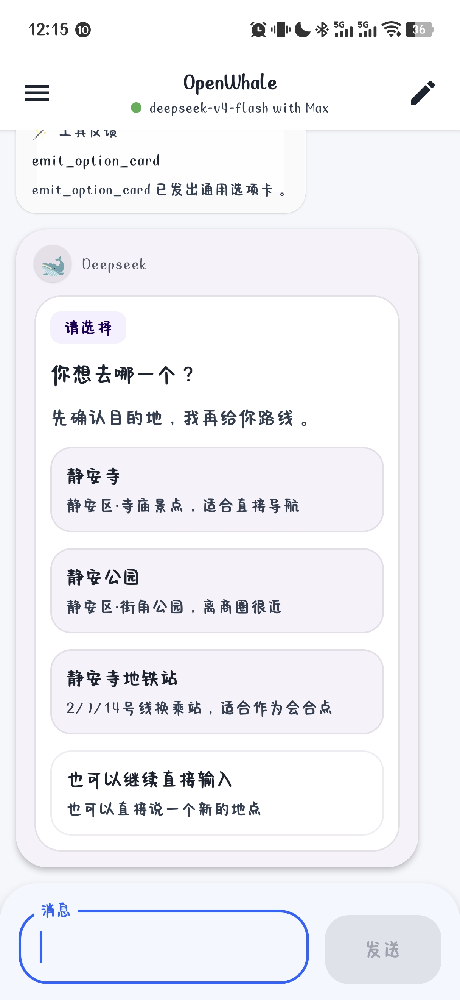
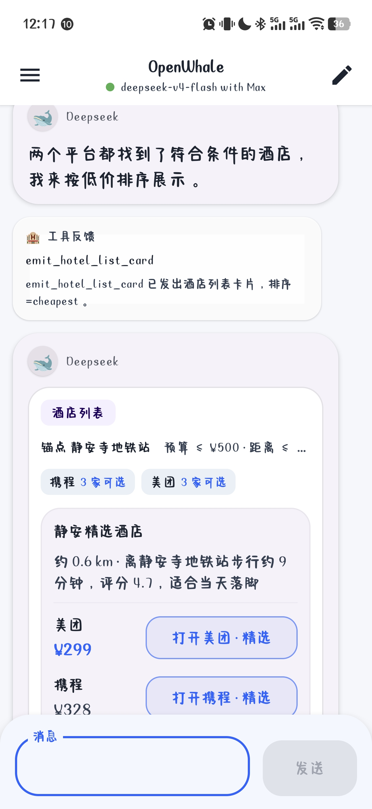

<h1 align="center">🐋 OpenWhale</h1>

<p align="center">
  <strong>专为生活场景设计的手机端开源 Agent</strong><br>
  官方平台一手数据 · 模型自由接入 · 交互式 UI 卡片 · 数据本地存储
</p>

<p align="center">
  <a href="#-痛点">痛点</a> ·
  <a href="#-解决方式">解决方式</a> ·
  <a href="#-核心优势">核心优势</a> ·
  <a href="#-架构">架构</a> ·
  <a href="#-快速开始">快速开始</a> ·
  <a href="#-路线图">路线图</a>
</p>

<br>

<p align="center">
  
  
  
</p>

---

## 🤔 痛点

你在手机上和 AI 对话时，是不是经常遇到这种情况：

想让 AI 帮忙找一家便宜的酒店、推荐一个靠谱的餐厅——它确实回答了，但信息来自**某篇自媒体文章、某个 SEO 网页、或者不知道哪来的"测评帖"**。这些内容充斥着软广、过时信息，甚至有专门针对 AI 的投毒内容。

你心想：**"算了，还不如我自己打开美团 / 高德 / 携程去看。"**

但自己打开 App 呢——要在搜索框里打字、翻列表、对比价格、筛选距离……确实又要花时间。手机屏幕这么小，在几个 App 之间反复切换比价，体验并不好。

**这就是 OpenWhale 要解决的问题。**

## 💡 解决方式

**让 AI 直接去官方平台查信息，然后把结果做成你可以在手机上直接点击的卡片。**

```
你不是想自己打开 App 查吗？
→ Agent 帮你打开了，而且是一次打开好几个平台。
你不是想对比筛选吗？
→ Agent 用模型的推理能力帮你筛完了。
你不是想在手机上操作方便吗？
→ 结果是一张可点击的卡片，不需要看长文本再手动跳转。
```

具体来说，OpenWhale 做三件事：

1. **通过 MCP 直连官方平台**——高德、美团、携程等，拿到的是一手结构化数据，不是二手文章
2. **由模型对这些数据进行推理筛选**——根据你的预算、距离、偏好，帮你做出最优选择
3. **输出交互式 UI 卡片**——不只是文字回复，而是一张你可以直接点击选择、比价、跳转的卡片

<br>

<p align="center">
  <em><strong>同一个问题，不同的回答方式</strong></em>
</p>

| 传统 AI 助手 | OpenWhale |
|---|---|
| "为您找到以下酒店：XX酒店 ¥328…" ← 你可能不知道这数据从哪来的 | 一张**跨平台比价卡片**，美团/携程官方价格并列，来源透明，点击直接跳转下单 |
| "您可以打开地图导航到静安寺" | 一张**路线卡片**，驾车/公交/步行/骑行切换，一键拉起高德 |
| "静安寺有多个地点，请确认" | 一张**选项卡片**，候选地点清晰列出，点一下就行 |

## ✨ 核心优势

### 🔗 一手官方数据，不是二手文章

大多数 AI 产品的工作方式是：**搜索网页 → 找到文章 → 提取信息 → 回复你**。

OpenWhale 的方式是：**MCP 直连官方平台 → 结构化数据 → 模型推理 → 结果给你**。

```
❌ 传统 AI 路径
   用户提问 → 搜索引擎 → 自媒体/SEO文章 → 文本提取 → 回复
   ─────────────────────────────────────────────────────────
   问题：软广、AI 投毒、信息过时、来源不明

✅ OpenWhale 路径
   用户提问 → MCP Server → 官方平台 API → 结构化数据 → 模型推理 → 交互卡片
   ─────────────────────────────────────────────────────────
   优势：一手数据、来源透明、实时准确、可直接跳转
```

你看到的价格来自美团/携程的官方接口，路线来自高德的实时数据。不是某个"探店博主"三个月前写的帖子。

### 🃏 交互式 UI 卡片，手机上的最佳交互

在手机上，长文本阅读和手动复制跳转的体验都很差。OpenWhale 的核心交互单元是 **UI 卡片**——Agent 可以按你的场景，动态输出最适合的卡片类型：

- **选项卡片**：多选一，点一下就把选择反馈给 Agent，继续后面的流程
- **比价卡片**：跨平台价格并列，一键跳转下单
- **路线卡片**：多种出行方式切换，一键拉起地图导航
- **更多卡片**：Agent 可以**自定义卡片样式**，也可以使用内置模板——灵活适配不同生活场景

所有卡片都支持在对话流内直接交互，不需要跳出 App 手动操作。

### 🔑 模型自由接入

不绑定任何厂商。在 App 内直接填入你的 API Key，即可接入 DeepSeek 或任何兼容 OpenAI 接口的模型。你的 Key、你的模型、你的数据。

- App 内配置，无需重新打包
- 支持随时切换模型
- 不依赖任何特定厂商的服务

### 🔒 数据留在本地

对话历史、偏好设置、筛选条件——所有数据存储在手机本地。没有厂商用你的数据训练模型，没有第三方拿到你的行为画像。后续还将引入结构化记忆系统，让 Agent 更了解你——但数据始终在你自己的设备上。

### 🌏 开源

代码完全透明。Agent Loop 怎么跑的、工具怎么调用的、卡片怎么生成的，全都可以自己看、自己改。

## 🏗️ 架构

```
                    ┌──────────────────────────┐
                    │      用户自然语言输入       │
                    └────────────┬─────────────┘
                                 │
                                 ▼
               ┌─────────────────────────────────────┐
               │           OpenWhale Agent            │
               │                                     │
               │   AgentSession → AgentLoopRunner     │
               │        │              │              │
               │        ▼              ▼              │
               │   工作流系统      工具注册表          │
               │   (Prompt)    (ToolRegistry)         │
               │        │              │              │
               │        └──────┬───────┘              │
               │               ▼                      │
               │        ModelProvider                 │
               │        (DeepSeek / 自定义)            │
               └───────────────┬─────────────────────┘
                               │
                               ▼
          ┌────────────────────────────────────────────┐
          │              MCP 工具层                      │
          │                                             │
          │  ┌──────────┐ ┌──────────┐ ┌──────────┐    │
          │  │ 高德地图  │ │  美团    │ │  携程    │ ... │
          │  │ 导航·路线 │ │ 酒店·餐厅│ │ 酒店·机票│    │
          │  └──────────┘ └──────────┘ └──────────┘    │
          │              官方平台一手数据                 │
          └────────────────────┬───────────────────────┘
                               │
                               ▼
          ┌────────────────────────────────────────────┐
          │              交互式 UI 卡片                  │
          │                                             │
          │  ┌──────────┐ ┌──────────┐ ┌──────────┐    │
          │  │ 选项卡片  │ │ 路线卡片  │ │ 比价卡片  │ ... │
          │  │ 点击选择  │ │ 切换出行  │ │ 跨平台比较 │    │
          │  └──────────┘ └──────────┘ └──────────┘    │
          │           Agent 可自定义样式或使用模板        │
          └────────────────────────────────────────────┘
```

完整的数据流和模块说明见 [知识库文档](./kb/architecture.md)。

## 📚 知识库

| 文档 | 内容 |
|------|------|
| [architecture.md](./kb/architecture.md) | 项目总览、技术栈、模块地图、数据流向、设计决策 |
| [agent.md](./kb/agent.md) | AgentSession 生命周期、LoopRunner 执行流程、数据模型、ModelProvider |
| [workflow.md](./kb/workflow.md) | 工作流系统、工具注册表、卡片体系、扩展指南 |
| [interface.md](./kb/interface.md) | UI 入口链路、布局结构、组件树、Timeline 渲染分发、主题系统 |

## 🚀 快速开始

### 环境要求

- Android Studio Hedgehog 及以上
- JDK 17
- Android SDK 34+

### 构建

```bash
git clone https://github.com/nicedayforget/openWhale.git
cd openWhale

# 在 local.properties 或 gradle.properties 中配置：
# DEEPSEEK_API_KEY=your_api_key
# DEEPSEEK_BASE_URL=https://api.deepseek.com
# DEEPSEEK_MODEL=deepseek-chat

./gradlew assembleDebug
```

也可以在 App 内的"设置 → DeepSeek Key"面板中直接填入 Key，无需重新打包。

### Demo 工作流

| 工作流 | 试试输入 |
|--------|----------|
| `general_chat` | "今天适合出门散步吗" |
| `navigation_hotel` | "导航到静安寺" → "这个附近的酒店帮我找个便宜的" |

## 🗺️ 路线图

**当前（Demo）**
- [x] Agent Loop：流式对话、工具调用、多轮推理
- [x] 交互卡片：选项卡、路线卡、酒店比价卡
- [x] DeepSeek 接入（含 thinking mode）
- [x] 本地 API Key 管理 · 思考轨迹可视化
- [x] 项目知识库文档

**下一阶段（v1.0）**
- [ ] 接入高德、美团、携程真实 MCP Server
- [ ] **动态卡片渲染**：Agent 自主生成卡片样式，不依赖固定模板
- [ ] 结构化记忆系统：记住用户偏好、常用地点
- [ ] 多模型并行调度

**远期**
- [ ] 开放卡片市场：社区贡献模板和 MCP 连接器
- [ ] 端到端加密的跨设备记忆同步
- [ ] 多模态输入（拍照识店、语音导航）
- [ ] 多 Agent 协作（导航 + 酒店 + 餐厅协同规划）

## 🛠️ 技术栈 & 开发工具

**App 技术栈**：Kotlin · Jetpack Compose · Material3 · StateFlow · OkHttp · kotlinx.serialization · MCP

**本项目开发工具**：Claude Code + OpenSpec

> ⚠️ **当前为 Demo 阶段**，所有工具使用 mock 数据。真实 MCP Server 接入在下一阶段计划中。

## 🤖 AI Agent 贡献指南

本项目推荐 AI Agent 作为主要开发方式。如果你是一个 Agent 拉取了本仓库，请按以下流程工作：

1. **先读 README**（你在看的就是）——了解项目定位和核心设计理念
2. **再读知识库**（[`kb/`](./kb/)）——理解架构、Agent 运行时、工作流、UI 层的完整细节
3. **修改代码**——完成你的任务
4. **反向更新知识库**——代码改动后，**务必同步更新 `kb/` 中对应的文档**，确保知识库始终反映代码的最新状态

知识库是项目的活文档层。OpenSpec 的 spec 文件属于 change 级别的提案（更适合单人/单 Agent 的结构化开发流），而 KB 文件是跨 change 的持续维护层——Agent 每次修改后都应该更新它。

## 📄 License

Apache License 2.0

---

<p align="center">
  <em>把 Agent 装进口袋，把数据留给自己。</em>
</p>
